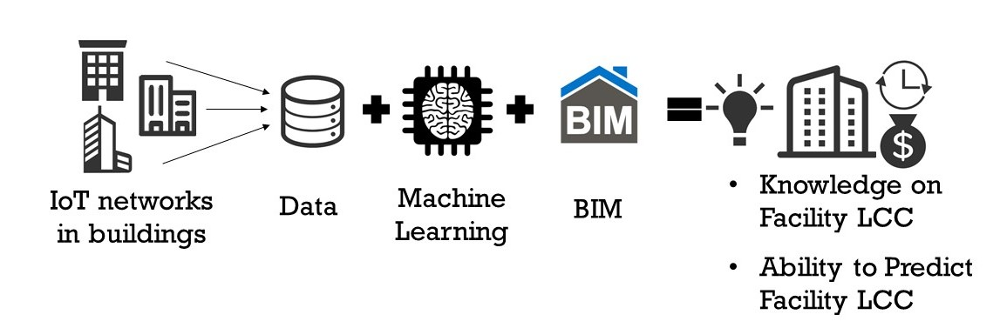
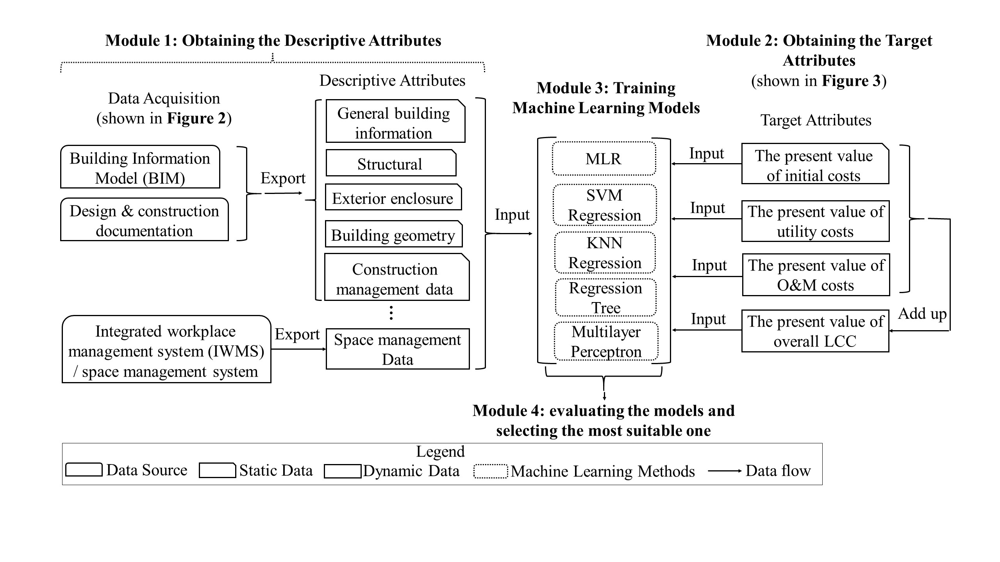

# Developing Machine Learning Models for Facility Life-cycle Cost Analysis through BIM and IoT

A significant allocation of resources is dedicated to the construction and maintenance of buildings. To minimize the total cost of facility ownership, it is essential to prioritize the reduction of life-cycle costs (LCC) instead of solely focusing on the initial design and construction expenses. This research project has developed a framework for facility life-cycle cost analysis (LCCA) using machine learning, leveraging data obtained from Building Information Models (BIM) and the Internet of Things (IoT).

This Ph.D. research study was conducted by [Dr. Ray Gao](http://www.ray-gao.com/), formerly known as Xinghua Gao, at the Georgia Institute of Technology.

- [Dr. Gao’s Ph.D. thesis](papers/2019_dissertation.pdf)
- Published articles:
    - [A framework of developing machine learning models for facility life-cycle cost analysis](papers/2020_lcca.pdf)
    - [Machine Learning-Based Building Life-Cycle Cost Prediction: A Framework and Ontology](papers/2020_ontology.pdf)
    - [Machine Learning-based Life-cycle Cost Analysis for Educational Facilities](papers/2019_educational.pdf)
    - [Machine Learning Applications in Facility Life-Cycle Cost Analysis: A Review](papers/2019_review.pdf)

This study is under an umbrella research program [Internet of Things Enabled Data Acquisition Framework for Smart Building Applications](https://github.com/XinghuaGao/IoT-building-data#internet-of-things-enabled-data-acquisition-framework-for-smart-building-applications), which is initiated by Dr. Gao.

## An Automated Approach to Calculate and Predict Life-Cycle Costs for New and Existing Buildings

We propose a comprehensive and generalizable framework for developing machine learning models for facility life-cycle cost (LCC) analysis. This framework outlines the data requirements, methods, and anticipated outcomes at each stage of the model development process. Initially, a literature review and questionnaire survey were conducted to identify the independent variables that influence facility LCC and to determine potential data sources. Subsequently, the process of utilizing raw data to derive LCC components is explained. Lastly, a proof-of-concept case study was conducted on a university campus to showcase the practical application of the proposed framework.

## **This Repository and the Source Code**

This repository serves as the index for the related research results and source code.

[code/data_analysis.R](code/data_analysis.R) performs a comprehensive analysis of facility life-cycle cost data. It loads the data and then processes it, including renaming columns, removing outliers, and creating new features. The script generates a dataset normalized by the square footage of the facility. It carries out correlation analysis between different variables, visualizes data through histograms and plots of the count of buildings by owner and cost per square foot. The script concludes by exporting correlation tables for future use. The overall aim is to understand the relationships between different variables in the life-cycle cost of facilities.

[code/ml_models.R](code/ml_models.R) begins by setting parameters, such as the number of iterations, the threshold for building age, and the models to be trained. The models included are Linear Regression, K-Nearest Neighbors (KNN), Random Forest, Support Vector Machines (SVM), and Multilayer Perceptron (MLP), both for single and multi-output. TensorFlow was used to train the ANN models. The script imports and preprocesses the data, removing outliers and normalizing the data. The main loop of the script partitions the data into training, test, and validation sets, trains the selected models, and evaluates each model. The results from all iterations are stored and then averaged to obtain the final result.

## **Project Team and Contributors**

[Dr. Ray Gao](http://www.ray-gao.com/)

[Dr. Pardis Pishdad-Bozorgi](https://bc.gatech.edu/people/pardis-pishdad-bozorgi)

[Dr. Dennis Shelden](https://www.case.rpi.edu/people/dennis-shelded)

[Dr. Javier Irizarry](https://bc.gatech.edu/people/javier-irizarry)

[Dr. Polo Chau](https://poloclub.github.io/polochau/)

[Andreas Kristanto](https://www.linkedin.com/in/andreas-kristanto-cce-mrics-04b5172/)

[Dr. Shu Tang](https://www.xjtlu.edu.cn/en/departments/academic-departments/civil-engineering/staff/shu-tang)
